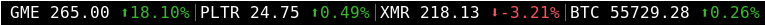

## Setup



### Dependencies
* i3wm
* i3blocks
* Python 3
* Pip
### Configurations
1. Enable execute permission for script.
```sh
chmod +x i3markets
pip install -r requirements.txt
```
2. In i3-blocks config, set `markup=pango`.
###  Adding Tickers 
To monitor multiple assets just add more blocks to your config file.
#### Adding stock tickers
For regular stocks add the following block to your i3-blocks config.
```
[i3markets]
command=$SCRIPT_DIR/i3blocks-markets/i3markets 
label=PLTR 
ticker=PLTR #example ticker replace with your own
interval=30
precision=2
```
#### Adding cryptocurrency tickers
For cryptocurrencies add the following block to your config. Make sure the `CRYPTO` flag is set to `True`.
```
[i3markets]
command=$SCRIPT_DIR/i3blocks-markets/i3markets
label=XMR
ticker=XMRUSDT #example ticker replace with your own
interval=30
precision=2
CRYPTO=True
```
Crypto relies on the Binance API, thus the tickers most be a Binance supported trading pair. To monitor prices in fiat choose a trading pair that contains a fiat pegged coin such as USDT or BUSD.

For example if you want to monitor Monero in US dollar you would use XMRUSDT.

The percentage change shown for cryptocurrency is for the past 24hrs.
### Option flags
**label** -  Is what is shown next to the ticker prices, I choose to use the ticker name itself. You can replace it with emojis if you want.

**ticker** - Stock tickers for stocks, and Binance trading pairs for cryptocurrency.

**interval** - Refresh rate of price updates, this is measured in seconds. Be careful not to spam the Binance API, this could 
result in a IP ban of up to 3 days.

**precision** - Decimal precision of prices and percentage change.

**CRYPTO** - Set this flag to ``True`` if the ticker is a crypto.
